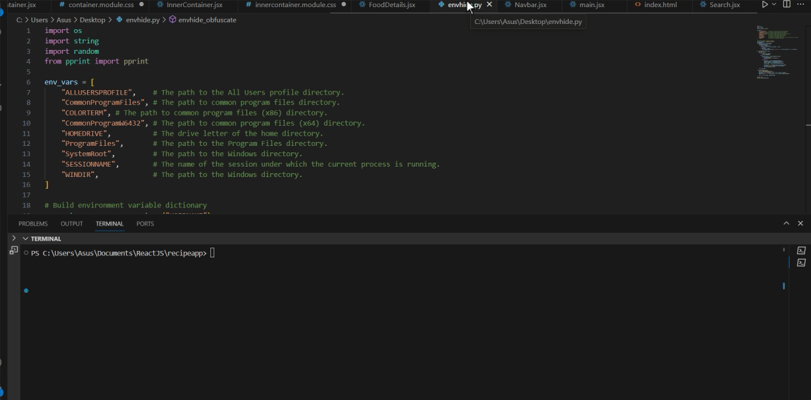

# PowershellEnv-Obfuscate
This is a follow through from a video by John Hammond "How Hackers Can Hide PowerShell in Environment Variables".
This code obfuscates your powershell commands.

For Example:
```ps
# Executes whoami
 & ($env:CommonProgramFiles[25],$env:ProgramFiles[14],[char]120 -Join $70257) ([char]119,[char]104,$env:SESSIONNAME[1],$env:ProgramFiles[8],$env:CommonProgramFiles[19],$env:CommonProgramFiles[12] -Join $35034)
```

# Demo

